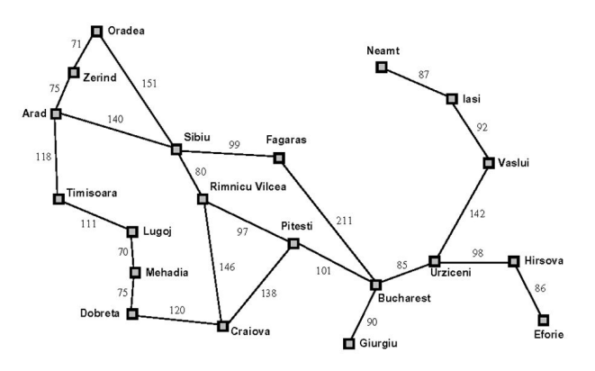

# City Search Problem 

These project resolves City Search Problem using searching graph algorithms that optimitize
the path cost from one city to another. We have included a graph whose nodes are Romania's cities
in order to illustrate how the code works, but you can try other instances. Furthermore, the
main execution of this program returns the minimum path for some cities from Romania, as well as
how many nodes have been expanded during the search. 
 

## Search Strategies

- Breadth first graph search (BFS)
- Depth first graph search (DFS)
- Branch and bound graph search (BBS)
- Branch and bound with subestimation graph search (BBES)

## Comparison of expanded nodes between BBS and BBES

In this comparative table you can see the number of expanded nodes obtained using the BBS and BBES techniques.
Therefore, we can say that the paths chosen by both search algorithms are the same, except that the number of expanded
nodes obtained by the branch and bound with underestimation are the smallest. This is because the second algorithm is
an informed graph search while the other one does not know any information about destination.
 

BB Search | BBE Search
------|-------
28 | 23
20 | 18
36 | 30
9 | 4
28 | 21

## Authors

- losedavidpb: [https://github.com/losedavidpb](https://github.com/losedavidpb)
- SergioULPGC: [https://github.com/SergioULPGC](https://github.com/SergioULPGC)